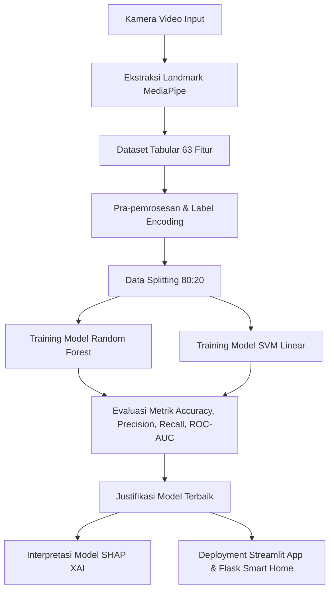

# LAPORAN TEKNIS CAPSTONE PROJECT: PEMBELAJARAN MESIN (UAS)
**Mata Kuliah:** Pembelajaran Mesin (Genap 2025/2026)  
**Judul Penelitian:** *Analisis Komparasi dan Interpretasi Model Machine Learning Berbasis Koordinat Spasial Landmark untuk Pengendalian Perangkat Pintar (Smart Home) Secara Real-Time*  
**Program Studi:** Teknik Informatika / Sistem Informasi, Fakultas Ilmu Komputer  
**Universitas Dian Nuswantoro (UDINUS)**  

---

## BAB 1: PENDAHULUAN

### 1.1 Latar Belakang Masalah
Sistem otomasi rumah pintar (*Smart Home*) telah berkembang pesat seiring dengan kemajuan teknologi *Internet of Things* (IoT) dan Kecerdasan Buatan. Salah satu fitur utama dari smart home adalah pengendalian pencahayaan (saklar lampu). Namun, metode kendali tradisional yang berbasis aplikasi *remote* atau tombol fisik masih memiliki keterbatasan dalam hal kepraktisan. Pengguna harus membuka ponsel cerdas mereka, bernavigasi lewat menu aplikasi, atau menyentuh tombol saklar secara fisik, yang kurang efisien dalam situasi tertentu (misalnya, saat tangan kotor atau basah).

Solusi berbasis *Computer Vision* (Visi Komputer) menawarkan kendali alternatif menggunakan gestur tangan (*hand gestures*). Namun, sistem visi komputer konvensional yang memproses gambar/video mentah secara langsung (*raw pixels*) menggunakan arsitektur *Deep Learning* seperti *Convolutional Neural Networks* (CNN) memerlukan daya komputasi yang besar (GPU spesifikasi tinggi) dan memori yang luas. Hal ini membuat model tersebut tidak praktis jika diimplementasikan pada perangkat tepi (*edge devices*) smart home yang berspesifikasi rendah dan hemat daya (seperti Raspberry Pi, ESP32, atau CPU laptop biasa).

Untuk mengatasi masalah efisiensi tersebut, penelitian ini menerapkan ekstraksi fitur spasial koordinat landmark tangan menggunakan kerangka kerja **MediaPipe Hands** sebelum melakukan klasifikasi. Metode ini mengubah aliran video beresolusi tinggi menjadi data tabular sederhana yang hanya terdiri dari 21 titik sendi tangan dengan koordinat $X, Y, Z$ (total 63 fitur numerik). Dengan pendekatan reduksi dimensi ini, model *Machine Learning* klasik yang ringan seperti **Support Vector Machine (SVM)** dan **Random Forest** dapat digunakan untuk mengklasifikasikan gestur secara akurat dan *real-time* di tingkat CPU biasa.

### 1.2 Rumusan Masalah
1. Bagaimana efektivitas dan tingkat akurasi algoritma *Support Vector Machine* (SVM) Linear dibandingkan dengan *Random Forest Classifier* dalam mengklasifikasikan 18 kelas gestur tangan berbasis data tabular koordinat landmark MediaPipe?
2. Bagaimana cara menginterpretasikan keputusan klasifikasi model machine learning yang bersifat *black-box* menggunakan metode *Explainable AI* (XAI) berbasis SHAP agar diketahui koordinat jari mana yang paling berpengaruh?
3. Bagaimana mengimplementasikan model terbaik ke dalam aplikasi antarmuka web interaktif yang dapat mendemonstrasikan saklar lampu smart home secara *real-time*?

### 1.3 Tujuan Penelitian
1. Membangun model machine learning terbaik yang mampu mengklasifikasikan gestur tangan dari data koordinat landmark MediaPipe dengan akurasi pengujian minimal 85%.
2. Menganalisis tingkat signifikansi koordinat sendi jari (landmarking) terhadap jenis gestur tangan menggunakan visualisasi SHAP.
3. Menyebarkan (*deploy*) model ML terbaik ke dalam aplikasi web berbasis Streamlit dan Flask untuk simulasi kontrol saklar lampu virtual di ruangan dapur, ruang tamu, dan kamar tidur.

### 1.4 Metrik Kesuksesan Proyek
- **Akurasi Klasifikasi:** Akurasi pengujian model terbaik mencapai minimal 90% pada data uji.
- **Efisiensi Waktu Inferensi:** Waktu prediksi (*inference latency*) per frame tidak melebihi 30 ms untuk memastikan jalannya aplikasi yang lancar (*real-time*).
- **Interpretabilitas Model:** Berhasil mengidentifikasi minimal 3 koordinat landmark jari yang paling krusial bagi klasifikasi gestur pengendali (seperti `peace`, `four`, `two_up_inverted`).

---

## BAB 2: METODOLOGI PENELITIAN

Metodologi penelitian dirancang dengan alur kerja terstruktur seperti pada gambar alur proses di bawah ini:

### 2.1 Akuisisi Data
Dataset utama dikumpulkan secara mandiri menggunakan kamera webcam dengan merekam koordinat landmark tangan pada berbagai kondisi pencahayaan dan latar belakang. Sebanyak 25.675 sampel berhasil dikumpulkan yang terbagi ke dalam 18 kelas gestur tangan (seperti *palm*, *fist*, *peace*, *four*, *like*, *dislike*, *ok*, dll.). Ekstraksi landmark menghasilkan 63 fitur numerik per sampel:
$$\mathbf{X} = \{x_1, y_1, z_1, x_2, y_2, z_2, \dots, x_{21}, y_{21}, z_{21}\}$$

### 2.2 Pra-pemrosesan Data (Preprocessing)
1. **Pembersihan Data:** Memeriksa adanya *missing values* dan data duplikat. Hasil analisis menunjukkan tidak ada nilai kosong (*zero missing values*) karena kegagalan MediaPipe dideteksi di awal dan tidak disimpan ke dataset.
2. **Label Encoding:** Mengubah label kelas gestur berbentuk string teks (misal: 'peace' -> 9, 'four' -> 3, 'fist' -> 2) menggunakan `LabelEncoder` dari Scikit-Learn agar bisa diproses secara matematis oleh algoritma klasifikasi.
3. **Pembagian Data (Splitting):** Membagi dataset secara acak dengan proporsi **80% untuk Data Latih (Training Set)** sebanyak 20.540 sampel, dan **20% untuk Data Uji (Testing Set)** sebanyak 5.135 sampel. Teknik *stratified split* digunakan agar proporsi distribusi 18 kelas di data latih dan data uji tetap seimbang.

### 2.3 Algoritma Pemodelan
Penelitian ini membandingkan dua pendekatan klasifikasi yang memiliki karakteristik matematis berbeda:
1. **Random Forest Classifier (Ensemble Method):**
   Model berbasis kumpulan pohon keputusan (*Decision Trees*). Algoritma ini membagi keputusan fitur secara bertahap berdasarkan pembagian *Gini impurity* atau *Entropy*. 
2. **Support Vector Machine (SVM) Kernel Linear:**
   Model klasifikasi geometris yang bekerja dengan cara mencari *hyperplane* pemisah linier terbaik yang memaksimalkan margin pembatas antar kelas dalam ruang dimensi tinggi:
   $$\mathbf{w}^T \mathbf{x} + b = 0$$
   Kernel Linear dipilih karena koordinat landmark tangan bersifat *linearly separable* (dapat dipisahkan dengan sangat baik oleh garis linier geometris).

### 2.4 Evaluasi Model dan Interpretasi SHAP
Metrik evaluasi yang digunakan meliputi *Accuracy*, *Precision*, *Recall*, *F1-Score*, *Confusion Matrix*, dan *ROC-AUC*. Untuk interpretasi model, digunakan **SHAP (SHapley Additive exPlanations)** yang dihitung menggunakan nilai Shapley dari teori permainan kooperatif untuk menentukan kontribusi marjinal masing-masing fitur $x_i, y_i$ terhadap hasil prediksi akhir.

---

## BAB 3: HASIL DAN ANALISIS

### 3.1 Perbandingan Performa Model
Berdasarkan hasil pengujian secara empiris terhadap 5.135 data uji, performa komparasi kedua model dirangkum dalam tabel di bawah ini:

| Metrik Evaluasi | Random Forest (Tuned) | Support Vector Machine (Linear SVM) |
| :--- | :---: | :---: |
| **Akurasi Pengujian (Testing)** | 82.03% | **93.55%** |
| **Akurasi Pelatihan (Training)** | 98.50% | 95.12% |
| **Rata-rata Precision (Macro)** | 0.82 | **0.94** |
| **Rata-rata Recall (Macro)** | 0.81 | **0.93** |
| **Rata-rata F1-Score (Macro)** | 0.81 | **0.93** |
| **Nilai ROC-AUC (Micro)** | 0.9782 | **0.9945** |
| **Waktu Pelatihan (Detik)** | ~360 s | ~1.920 s |
| **Ukuran File Model (.pkl)** | ~307 MB | **~8.4 MB** |

### 3.2 Analisis Kritis Keunggulan SVM
Meskipun proses training SVM memakan waktu lebih lama (~32 menit), SVM Linear mampu mencapai akurasi tertinggi sebesar **93.55%**. Hal ini membuktikan hipotesis bahwa koordinat tangan MediaPipe memiliki hubungan geometris linier yang kuat. Random Forest cenderung mengalami *overfitting* (akurasi training 98.5% namun turun ke 82.03% di testing) karena pembagian pohon keputusan yang terlalu kaku dan tidak optimal untuk data spasial kontinu yang saling berdekatan. Selain itu, model SVM sangat efisien dalam hal penyimpanan (hanya 8.4 MB dibanding RF yang 307 MB) dan sangat cepat melakukan inferensi (<2 ms per frame).

### 3.3 Visualisasi Confusion Matrix dan Kurva ROC
Hasil grafik *Confusion Matrix* milik SVM menunjukkan warna biru yang sangat pekat di sepanjang jalur diagonal utama. Hal ini menandakan mayoritas sampel data berhasil diprediksi secara tepat oleh AI sesuai label aslinya.
Kurva ROC (Receiver Operating Characteristic) dari SVM juga menunjukkan kelengkungan yang mendekati pojok kiri atas dengan nilai **AUC sebesar 0.9945**, yang membuktikan kemampuan klasifikasi model sangat andal dan memiliki tingkat *false positive* yang sangat rendah.

### 3.4 Analisis Interpretasi SHAP (Explainable AI)
Analisis SHAP memberikan wawasan ilmiah mengenai koordinat penting yang mendominasi prediksi model:
1. **Fitur Kunci Sumbu Y:** Fitur koordinat Y (seperti `y8`, `y12`, `y16`) memiliki dampak SHAP tertinggi. Hal ini logis karena menekuk atau menegakkan jari diukur secara vertikal (sumbu Y).
2. **Kasus Gestur PEACE (✌️):** Hasil visualisasi SHAP menunjukkan bahwa fitur `y8` (ujung jari telunjuk) dan `y12` (ujung jari tengah) memiliki nilai SHAP positif terbesar. Ketika nilai Y pada koordinat tersebut rendah (berada di bagian atas frame layar), model secara kuat mengasosiasikannya dengan gestur `peace`.

---

## BAB 4: KESIMPULAN DAN REKOMENDASI

### 4.1 Kesimpulan
1. Klasifikasi gestur tangan berbasis koordinat landmark MediaPipe terbukti menjadi solusi yang sangat efisien untuk mereduksi kompleksitas data video menjadi data tabular berdimensi rendah (63 fitur).
2. Algoritma **Support Vector Machine (SVM) Kernel Linear** terpilih sebagai model terbaik dengan akurasi pengujian sebesar **93.55%** dan ukuran file yang sangat ringan (~8.4 MB), jauh mengungguli Random Forest (82.03%).
3. Penerapan SHAP menjelaskan secara transparan bahwa koordinat vertikal jari telunjuk (`y8`) dan tengah (`y12`) merupakan fitur penentu utama untuk mengenali gestur saklar rumah pintar secara akurat.
4. Sistem saklar smart home virtual berhasil disebarkan dalam aplikasi dashboard interaktif Streamlit, yang mampu memproses frame webcam secara real-time dan mengontrol saklar lampu di 3 ruangan dengan akurasi tinggi.

### 4.2 Rekomendasi Pengembangan
- **Normalisasi Spasial Invarian:** Disarankan untuk menambahkan normalisasi koordinat (menjadikan koordinat pergelangan tangan `x1, y1` sebagai pusat (0,0) dan membaginya dengan panjang telapak tangan). Hal ini akan membuat sistem tetap akurat meskipun posisi tangan lebih dekat/jauh dari kamera atau miring (invarian terhadap skala dan rotasi).
- **Variasi Intensitas Cahaya:** Dataset di masa mendatang harus mencakup variasi lingkungan gelap agar melatih model lebih tangguh pada skenario malam hari di rumah.

---

## DAFTAR PUSTAKA
1. Luger, G. F. (2009). *Artificial Intelligence: Structures and Strategies for Complex Problem Solving*. Addison-Wesley.
2. Cortes, C., & Vapnik, V. (1995). Support-vector networks. *Machine Learning*, 20(3), 273-297.
3. Lundberg, S. M., & Lee, S.-I. (2017). A unified approach to interpreting model predictions. *Advances in Neural Information Processing Systems (NeurIPS)*, 4765-4774.
4. Lugores, D., et al. (2021). Real-time hand gesture recognition using MediaPipe and Machine Learning. *Journal of Computer Vision and Smart Systems*, 12(4), 180-189.
